<p align="center">
  
</p>

<h1 align="center">Action Log Analyzer</h1>

<p align="center">
  <strong>CI intelligence for every run — timing, test results, root cause analysis, and full build context.</strong>
</p>

<p align="center">
  <a href="https://github.com/marketplace/actions/action-log-analyzer"></a>
  <a href="LICENSE"></a>
</p>

Action Log Analyzer runs on **every workflow run** — whether jobs pass or fail. It posts a clear, actionable summary to your PR or Job Summary with timing intelligence, test result extraction, and full build documentation.

- **When jobs fail:** Root cause analysis, suggested fixes, error context, step timeline with slow step detection, test results, annotations, warnings, build parameters, cloned repos, actions/docker refs, artifact URLs
- **When jobs pass:** Job durations, test results, annotations, step timeline with slow step detection, warnings, build parameters, cloned repos, actions/docker refs, artifact URLs
- **Always:** Retry awareness, workflow context (trigger event, workflow name, run number)

**No external API keys. No extra cost. Just add one job to your workflow.**

---

## Quick Start

Add this job to your existing workflow file. Run on **both success and failure** for full visibility:

```yaml
analyze-logs:
  runs-on: ubuntu-latest
  needs: [your-build-job]   # replace with your actual job name
  if: always()              # runs on success AND failure
  permissions:
    actions: read           # read workflow logs and list artifacts
    pull-requests: write    # post PR comment

  steps:
    - uses: SKCloudOps/action-log-analyzer@v1
      with:
        github-token: ${{ secrets.GITHUB_TOKEN }}
```

To run **only when jobs fail** (failure analysis only):

```yaml
  if: failure()
```

`GITHUB_TOKEN` is **automatically available** — no setup, no cost, no external API keys required.

---

## What It Posts

| Scenario | What You Get |
|:---------|:-------------|
| **Jobs fail** | Root cause, failed step, suggested fix, error context, step timeline with slow step flags, job duration, test results (failed test names), annotations, warnings, build parameters, cloned repositories with branches, actions & docker images used, artifact/registry URLs, retry indicator |
| **Jobs pass** | Job durations with queue time, test results, annotations, step timeline with slow step flags, warnings, build parameters, cloned repositories with branches, actions & docker images used, artifact/registry URLs, workflow context |

Output appears in the **PR comment** and **Job Summary** tab. For commits to `main` without a PR, the summary appears in the Job Summary only.

---

## Architecture

```mermaid
flowchart TB
  subgraph trigger [Workflow Trigger]
    GHA["GitHub Actions<br/>Workflow Run"]
  end

  subgraph inputs [Data Sources]
    API["GitHub API<br/>(octokit)"]
    ENV["Runner Environment<br/>GITHUB_RUN_ATTEMPT<br/>GITHUB_RUN_NUMBER<br/>GITHUB_WORKFLOW"]
    CTX["github.context<br/>eventName, actor,<br/>ref, sha, payload"]
  end

  subgraph apiCalls [API Calls — index.ts]
    ListJobs["listJobsForWorkflowRun<br/>jobs, steps, timing"]
    ListArtifacts["listWorkflowRunArtifacts<br/>name, size, url"]
    DownloadLogs["downloadJobLogsForWorkflowRun<br/>raw log text"]
  end

  subgraph analysis [Analysis Engine — analyzer.ts]
    Patterns["loadPatterns<br/>local + remote patterns.json"]
    Analyze["analyzeLogs<br/>priority-sorted pattern matching"]
    Timing["computeJobTiming<br/>duration, queue, slow steps"]
    Tests["extractTestResults<br/>Jest, pytest, Go, JUnit,<br/>Mocha, RSpec, PHPUnit"]
    Annotations["extractAnnotations<br/>error, warning, notice"]
    Warnings["warning extraction<br/>categorized by type"]
    BuildParams["extractBuildParams<br/>env, input, cli-flag"]
    GitRefs["extractGitRefsFromLogs<br/>actions, docker, submodules"]
    ClonedRepos["extractClonedRepos<br/>repo, branch, commit, depth"]
    Links["extractLinksFromLogs<br/>artifact URLs, registry links"]
  end

  subgraph decision [Decision — index.ts]
    Check{"Failed<br/>jobs?"}
  end

  subgraph formatSuccess [Success Path — formatter.ts]
    SuccessSummary["formatSuccessSummary<br/>Job Summary tab"]
    SuccessPR["formatSuccessPRComment<br/>PR comment"]
  end

  subgraph formatFailure [Failure Path — formatter.ts]
    FailSummary["formatJobSummary<br/>Job Summary tab"]
    FailPR["formatPRComment<br/>PR comment"]
  end

  subgraph output [Outputs]
    JobSummary["Job Summary Tab"]
    PRComment["PR Comment"]
    ActionOutputs["Action Outputs<br/>root-cause, total-duration,<br/>test-summary, run-attempt, ..."]
  end

  GHA --> API
  GHA --> ENV
  GHA --> CTX
  API --> ListJobs
  API --> ListArtifacts
  API --> DownloadLogs
  ListJobs --> Timing
  DownloadLogs --> Analyze
  DownloadLogs --> Tests
  DownloadLogs --> Annotations
  DownloadLogs --> Warnings
  DownloadLogs --> BuildParams
  DownloadLogs --> GitRefs
  DownloadLogs --> ClonedRepos
  DownloadLogs --> Links
  Patterns --> Analyze
  ListJobs --> Check
  Check -->|"No"| SuccessSummary
  Check -->|"No"| SuccessPR
  Check -->|"Yes"| FailSummary
  Check -->|"Yes"| FailPR
  SuccessSummary --> JobSummary
  SuccessPR --> PRComment
  FailSummary --> JobSummary
  FailPR --> PRComment
  Check --> ActionOutputs
```



### Data Flow

1. **Input**: The action reads its configuration (`github-token`, `post-comment`, `post-summary`) and gathers context from the GitHub API, runner environment variables, and `github.context`.

2. **API Calls**: Three GitHub API endpoints provide the raw data — job metadata with step-level timing, workflow artifacts, and raw log text for each job.

3. **Analysis**: The log text is processed through multiple extraction engines in parallel:
   - **Pattern matching** (`analyzer.ts`) — matches log lines against priority-sorted patterns from `patterns.json` (local + optional remote) to identify root causes
   - **Timing** — computes job/step durations from API timestamps; flags slow steps (>5 min or >60% of job)
   - **Test results** — parses output from 8 test frameworks (Jest, Vitest, pytest, Go, JUnit, Mocha, RSpec, PHPUnit)
   - **Annotations** — captures `##[error]`, `##[warning]`, `##[notice]` before line cleaning strips them
   - **Build context** — extracts warnings, build parameters, Git refs, cloned repos, and artifact URLs

4. **Decision**: If any jobs failed, the failure path runs (root cause analysis + suggested fix). If all jobs passed, the success path runs (build documentation + timing).

5. **Output**: Results are formatted as markdown and posted to the Job Summary tab and/or as a PR comment. All extracted data is also available as action outputs for downstream steps (Slack notifications, custom dashboards, etc.).

---

## How It Works

- **On failure:** Pattern matching (patterns.json) detects known errors and suggests fixes. Patterns are matched by priority — higher-priority patterns win over generic ones. When no pattern matches, it provides a generic fallback and suggests adding a custom pattern.
- **On success:** Extracts artifact URLs, registry links, and other important links from job logs and surfaces them in the summary.
- **Timing intelligence:** Computes job and step durations from the GitHub API. Flags slow steps (over 5 minutes or consuming 60%+ of job time) with a turtle icon. Shows queue wait time when runners are contended.
- **Test results:** Parses output from Jest, Vitest, pytest, Go test, JUnit, Mocha, RSpec, and PHPUnit. Shows pass/fail/skip counts and lists failed test names.
- **Annotations:** Collects `##[error]`, `##[warning]`, and `##[notice]` annotations from logs and groups them by severity.
- **Retry awareness:** Detects re-runs and shows the attempt number so you can distinguish flaky failures from real regressions.
- **Workflow context:** Shows the trigger event (push, pull_request, schedule, etc.), workflow name, and run number.
- **Both paths:** Captures warnings from logs, detects build parameters (env vars, action inputs, CLI flags), identifies cloned repositories with branches, and documents all GitHub Actions and Docker images used with their versions.

---

## About GITHUB_TOKEN & Permissions

`GITHUB_TOKEN` is a **short-lived token automatically created by GitHub** at the start of every workflow run. You do not need to create it, pay for it, or manage it.

You must explicitly grant the permissions Action Log Analyzer needs:

| Permission | Why It's Needed |
|---|---|
| `actions: read` | Fetch job logs and list workflow artifacts |
| `pull-requests: write` | Post the analysis comment on the PR |

---

## What It Detects

| Category | Examples |
|---|---|
| **Docker** | Auth failures, missing images, disk space, bad Dockerfile path |
| **GitHub Actions** | Missing secrets, permission errors, timeouts |
| **Node.js / npm** | Missing modules, peer dep conflicts, permission errors |
| **Tests** | Failed test suites (Jest, Mocha, etc.) |
| **TypeScript** | Compilation errors |
| **Network** | Connection refused, API rate limits |
| **Kubernetes** | ImagePullBackOff, Helm failures |
| **Unknown** | Generic fallback with error line review |

---

## Inputs

| Input | Required | Default | Description |
|---|---|---|---|
| `github-token` | Yes | `${{ github.token }}` | Auto-available, no setup needed |
| `post-comment` | No | `true` | Post analysis as PR comment |
| `post-summary` | No | `true` | Post analysis in Job Summary tab |
| `failed-job-name` | No | `` | Analyze a specific job only (analyzes all if not set) |
| `remote-patterns-url` | No | `` | URL to fetch additional community patterns from |

---

## Outputs

Use these in later steps to build custom notifications or integrations:

| Output | Description |
|---|---|
| `root-cause` | Plain-English root cause (empty when all jobs pass) |
| `failed-step` | The step that caused the failure (empty when all jobs pass) |
| `suggestion` | Suggested fix |
| `matched-pattern` | Pattern ID that matched, or `none` |
| `category` | Category of the failure, or `Success` when all jobs pass |
| `warning-count` | Number of warnings detected in job logs |
| `build-params` | JSON array of detected build parameters `[{key, value, source}]` |
| `git-refs` | JSON array of detected actions, docker images, and repos `[{repo, ref, type}]` |
| `total-duration` | Total job duration as human-readable string (e.g. `2m 30s`) |
| `slowest-step` | Name of the slowest step in the job |
| `test-summary` | JSON object with test results `{framework, passed, failed, skipped, total, failedTests}` |
| `run-attempt` | Current run attempt number (1 for first run, higher for retries) |
| `run-number` | Workflow run number |
| `trigger-event` | Event that triggered the workflow (`push`, `pull_request`, `schedule`, etc.) |

### Example — Use outputs in a Slack notification

```yaml
- uses: SKCloudOps/action-log-analyzer@main
  id: lens
  with:
    github-token: ${{ secrets.GITHUB_TOKEN }}

- name: Notify Slack
  run: |
    echo "Root cause: ${{ steps.lens.outputs.root-cause }}"
    echo "Fix: ${{ steps.lens.outputs.suggestion }}"
    echo "Duration: ${{ steps.lens.outputs.total-duration }}"
    echo "Attempt: ${{ steps.lens.outputs.run-attempt }}"
```

---

## Adding Custom Patterns

Action Log Analyzer loads error patterns from `patterns.json` in the repo root. You can add your own patterns without touching any TypeScript:

```json
{
  "id": "my-custom-error",
  "category": "MyTool",
  "pattern": "my specific error message",
  "flags": "i",
  "rootCause": "Plain English explanation of what went wrong",
  "suggestion": "Specific steps to fix it",
  "severity": "critical",
  "tags": ["mytool", "custom"]
}
```

Custom patterns are fast, free, and always take priority.

---

## Project Structure

```
action-log-analyzer/
├── src/
│   ├── index.ts          # Entry point — orchestrates API calls, analysis, and output
│   ├── analyzer.ts       # Core analysis engine — pattern matching, timing, test parsing,
│   │                     #   annotations, build params, git refs, cloned repos
│   └── formatter.ts      # Markdown report generation — PR comments and Job Summaries
├── dist/                 # Compiled output (generated by ncc build)
├── patterns.json         # Error pattern definitions (40 patterns across 16 categories)
├── action.yml            # GitHub Action metadata — inputs, outputs, branding
├── example-usage.yml     # Example workflow showing how to use the action
├── test-patterns.js      # Pattern validation tests
└── README.md
```

| File | Role |
|:-----|:-----|
| `src/index.ts` | Reads inputs, calls GitHub API, coordinates analysis, posts results |
| `src/analyzer.ts` | All extraction logic: patterns, timing, tests, annotations, params, refs |
| `src/formatter.ts` | Converts extracted data into markdown tables and sections |
| `patterns.json` | Declarative error patterns — add your own without writing TypeScript |

---

## Contributing

Contributions are welcome! The easiest way to contribute is to **add new error patterns** to `patterns.json` — no TypeScript knowledge needed, just JSON.

Each pattern needs:
- `id` — unique identifier (e.g. `docker-auth`)
- `category` — group name (e.g. `Docker`, `Node.js`)
- `pattern` — regex string to match against log lines
- `flags` — regex flags (usually `"i"` for case-insensitive)
- `rootCause` — one sentence plain-English explanation
- `suggestion` — 2-3 sentences on how to fix it
- `severity` — `critical`, `warning`, or `info`
- `tags` — array of searchable tags
- `docsUrl` — (optional) link to related documentation shown in the report

See [CONTRIBUTING.md](CONTRIBUTING.md) for full details.

---

## License

MIT
